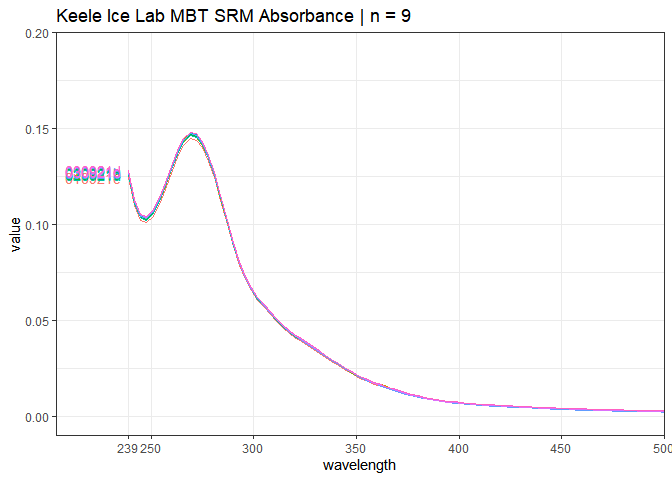

<!-- README.md is generated from README.Rmd. Please edit that file -->

# SampleQueue

<p align="center">

</p>
<!-- badges: start -->
<!-- badges: end -->

*No autosampler? No problem!*

The **SampleQueue** package is a streamlined file processing/handling
framework for the Horiba
[Aqualog](https://www.horiba.com/en_en/products/detail/action/show/Product/aqualog-water-treatment-plant-analyzer-1578/)
spectrofluorometer’s sample queuing (“SampleQ”) system. During SampleQ,
the Aqualog software automatically processes and corrects fluorescence
sample data based upon pre-set parameters, rapidly performing tasks that
would typically take far longer to do for individual samples (such as
correction for inner filter effects, Rayleigh masking, and
normalisation). SampleQ also avoids host computer slowdown from a
bloated user project folder.

Unfortunately, the SampleQ system only outputs files using a restrictive
file naming convention, comprising a basic combination of
prefixes/suffixes and sequential digits (e.g. Example001Sample0001 or
Example001Blank). This makes managing outputs extremely cumbersome.

This package provides a workaround, allowing the user to compile complex
runs using SampleQ via the creation of a ‘run sheet’, in a fashion that
should be familiar to users of other scientific instruments. Even using
run setups incorporating multiple blanks, standards and replicates, the
combination of SampleQ and **SampleQueue** allows for rapid sample
throughput, followed by easy management of the resulting data files. The
package also has support for automatic multi-blank subtraction.

#### A quick note on ASCII data types

At present **SampleQueue** supports the Processed
Excitation-Emission-Matrix (PEM), Absorbance (ABS), and Percent
Transmission (PCT) ASCII .dat file types. See ‘Supported file and data
types’ below.

## Using the SampleQueue package

The basic logic comprising the **SampleQueue** workflow is illustrated
below.

<p align="center">

</p>

Setting up the folder framework used by **SampleQueue** is performed by
choosing a parent directory and running `create_queue_folders()`. This
will fill that folder with all the sub-directories used by the package.

In a standard workflow, the user then compiles a ‘run sheet’. A run
sheet is comprised of a basic table containing a given run’s sample
queue names (i.e. the naming convention that will be used by the Aqualog
during analysis), the user’s own desired file names, and one of a number
of supported row-file ‘types’ (e.g. ‘sample’, “mqblank”, “sqblank”,
“standard”, “replicate”). An example is shown below.

``` r
data_example <- readRDS(file = "data/run_sheet_example.rds")
knitr::kable(data_example)
```

| Order | Remaining | SampleQ\_Name         | Real\_Name           | Type      | Checklist | Dilution\_Factor |
|------:|----------:|:----------------------|:---------------------|:----------|:----------|-----------------:|
|     1 |        10 | Example0001Blank      | swc\_sqblank\_050721 | sqblank   | NA        |               NA |
|     2 |         9 | Example0001Sample0001 | mqblank\_050721a     | mqblank   | NA        |               NA |
|     3 |         8 | Example0001Sample0002 | mqblank\_050721b     | mqblank   | NA        |               NA |
|     4 |         7 | Example0001Sample0003 | Sample\_1            | sample    | NA        |               NA |
|     5 |         6 | Example0001Sample0004 | Sample\_2            | sample    | NA        |               NA |
|     6 |         5 | Example0001Sample0005 | Sample\_3            | sample    | NA        |               NA |
|     7 |         4 | Example0001Sample0006 | Sample\_4            | sample    | NA        |                2 |
|     8 |         3 | Example0001Sample0007 | Sample\_5            | sample    | NA        |               NA |
|     9 |         2 | Example0001Sample0018 | StandardA\_050721a   | standard  | NA        |               NA |
|    10 |         1 | Example0001Sample0019 | Sample\_1\_re        | replicate | NA        |               NA |
|    11 |         0 | Example0001Sample0020 | mqblank\_050721c     | mqblank   | NA        |               NA |

Column names must match those shown in the example in order for the
package to work. The “Real\_Names” column can include any combination of
characters or digits reflecting your desired file naming convention. The
‘types’ determine categorisation and file sorting - for example, files
associated with run sheet rows marked ‘standard’ will be sorted and sent
to the standards folder. The checklist column is optional - I use it
whilst running samples on the Aqualog to ensure there is no chance of a
mix-up during the course of an analysis. Values entered into the
“Dilution\_Factor” column will be used to multiply that sample’s PEM
intensity values if the user elects to enable dilution correction.

Once analysis using SampleQ on the Aqualog is completed, the user
collates the files together in a single folder along with any project
(.opj) and text files (.txt). This folder should then be placed into to
the **SampleQueue** import directory.

After this, running the function `process_sample_queue()` with the
appropriate parameter inputs (correct run sheet, etc.) will
automatically rename and copy all the files to the appropriate folders
within the **SampleQueue** export folder. Optional parameters can be set
for milli-q blank subtraction and dilution.

 Here’s a small
example of what the console churns out whilst process\_sample\_queue()
is running. These EEMs were quite large; smaller EEMs will copy/transfer
much faster. The large volume of text is intentional, and gives an
explicit indication of which part of the processing caused an error,
should one occur.

After running a **SampleQueue** workflow, the user should be left with a
collection of appropriately named and sorted files that can then be
indexed and interrogated with the existing R fluorescence analysis
framework provided chiefly by the
[eemR](https://cran.r-project.org/web/packages/eemR/index.html),
[staRdom](https://github.com/MatthiasPucher/staRdom) and
[EEM](https://CRAN.R-project.org/package=EEM) packages.

If you have any questions or comments, please don’t hesitate to get in
touch.

This package is a work in progress. **Always back up your data!**

## Supported file and data types

The following file types are extracted from the designated folder by the
**SampleQueue** package.

### .txt files

Text files are collated together using the `generate_logfile()`
function. This operates by identifying all the text files in the
specified folder, importing them with `readLines()`, then combining them
together into a ‘log file’. The run sheet is also appended during this
process. Typically .txt files in the imported folder will be limited to
the Aqualog-produced log (AqualogSampleQLog.txt), but any user-generated
.txt files will also be included provided they are in the same folder as
all the other data files. I typically include a small text file that
contains my notes about the run and the calibration values used at the
time of run, including the normalisation value (e.g. RU norm factor, QSU
norm factor).

### .opj project files

The standard way of using the Aqualog software is to work in a project
file, which features the .opj file extension. Any and all project files
in the imported folder are copied (renamed) to the relevant folder in
the export directory using `transfer_project_files()`, with the imported
folder name appended to the project file name if it wasn’t already.

### .ogw workbook files

If the user has chosen to export workbook files with their data whilst
running the Aqualog sample queue, their chosen folder will be populated
with .ogw workbook files for each sample/blank. These files can be
loaded back into the Aqualog software to track all processing steps for
each file. As with the ASCII .dat files, each .ogw file is copied
(renamed in line with the run sheet) to an export folder matching the
sample type.

### ASCII .dat files

Depending on user choices during the SampleQ setup process on the
Aqualog, a number of different ASCII file types will be exported by the
system for each sample during analysis. All ASCII files have the .dat
file extension. The current version of **SampleQueue** supports the ABS
(absorbance data), PEM (sample-blank processed XYY) and PCT (percent
transmission) ASCII data types. The others will be added sporadically as
needed.

A pair of import functions are included for ABS and PCT data (see
example below for a simple example of ABS data handling). To read in PEM
data, use `eemR::eem_read(data_directory, import_function = "aqualog")`.

``` r
# packages, dirs
pacman::p_load(staRdom,eemR,ggplot2,SampleQueue,magrittr,tidyverse)
standard_ABS_dir <- "data/ILSMBT_spectra/"
# read, edit
MBT_ABS <- SampleQueue::ABS_read(standard_ABS_dir)
MBT_ABS <- pivot_longer(MBT_ABS,cols = 2:ncol(MBT_ABS))
names <- unlist(lapply(str_split(MBT_ABS$name,"ABS"),"[",1))
MBT_ABS$name <- str_remove(names, paste0("ILSMBT","_"))
minwav <- min(MBT_ABS$wavelength)
# plot
ggplot() +
  geom_line(data = MBT_ABS, aes(wavelength, value, color = name)) +
  theme_bw() +
  theme(legend.position = "none") +
  scale_y_continuous(expand = c(0,0), limits = c(-0.01,0.2)) +
  scale_x_continuous(expand = c(0,0), limits = c(minwav-35,500), breaks = c(239,250,300,350,400,450,500)) +
  geom_text(data = MBT_ABS %>% filter(wavelength == first(wavelength)), aes(label = name, x = wavelength - 17, y = value, color = name)) +
  ggtitle(paste0("Keele Ice Lab MBT SRM Absorbance | n = ", length(unique(MBT_ABS$name)))) +
  theme(panel.grid.minor.x = element_blank())
```



## OS Compatibility

The underlying code used for file management (copying, renaming) in
**SampleQueue** was written using on a machine running Windows. The
package has not been tested on Mac or Linux.

## Installation

To get access to the functions in **SampleQueue**, simply use the
**devtools** package to install the package from github.

``` r
devtools::install_github("MRPHarris/SampleQueue")
```

**SampleQueue** has a number of package dependencies. These extend from
string handling (e.g. stringr) to a number of packages required for
blank subtraction
([eemR](https://cran.r-project.org/web/packages/eemR/index.html),
[staRdom](https://github.com/MatthiasPucher/staRdom), and my own package
[eemUtils](https://github.com/MRPHarris/eemUtils)). Check the
[DESCRIPTION](DESCRIPTION) file for a list of the dependencies. They
should all (hopefully) be fetched automatically when you install and
load **SampleQueue**.

## Update Notes

22/07/21 \| SampleQueue is now fully functional!

23/07/21 \| Fixed a bug wherein attempting blank subtraction on a run
that contained no blanks resulted in an error.

06/09/21 \| Dilution support added. Targeted blank subtraction replaced
with a generalised ‘post processing’ function. The user can now
optionally perform blank subtraction as before, along with dilution
using a new column in the run sheet (Dilution\_Factor). Various parts in
the `process_sample_queue()` function have also been made more verbose.
This adds clutter to the console, but aids in error checking - it should
be pretty clear which part in the process caused a failure, if one
occurs.

07/09/21 \| Percent transmission (PCT) .dat ASCII file support added.
PCT .dat files now export in the same fashion as ABS files, to their own
folder in the file type export sub-directory.

13/09/21 \| Added Absorbance and Percent Transmission data importers,
`ABS_read()` and `PCT_read()`, for importing ABS and PCT .dat ASCII
files. Both functions are direct modifications of absorbance\_read()
from the staRdom package, with some adjustments to ensure .dat files are
read correctly.

14/10/21 \| Readme update for ABS reading and plotting.

18/10/21 \| Added support for a second ‘layer’ of optional blank
subtraction, in the form of a ‘pblank’ run sheet type. This is intended
for procedural blanks - blanks which aim to capture one or more
treatment steps prior to/upstream of laboratory handling. This might
include blanks of storage containers or sampling equipment. Procedural
blanks are first subject to dilution handling and milli-q blank
subtraction, where appropriate. They are then averaged (if more than one
is present in a run) and subtracted from samples and replicates in the
run. Note that pblanks are *not* subtracted from standards, as those are
assumed to not be subject to the upstream protocol targeted with the
pblank/s.

03/11/21 \| Added an additional run-sheet row type, ‘other’. Rows in the
run sheet listed as type ‘other’ will have their files sorted and sent
to the ‘other’ folder within the export directory without any
post-processing. This is intended for use with samples that didn’t run
properly - either due to premature ending of a run, or user error
(e.g. mismatch of samples, accidental repeats, etc.).

## Planned revisions

-   update error checking to provide more useful information in the
    event of (1) file copy failure, and (2) project file transfers. Some
    common errors (such as incompatible date usage, run sheet name/file
    mismatches) could probably be diagnosed automatically fairly easily.

-   add handling for more ASCII data types.

-   add processing options chosen (blank subtraction, etc.) to the
    exported logfile.

## References

Massicotte, P. (2019). eemR: Tools for Pre-Processing
Emission-Excitation-Matrix (EEM) Fluorescence Data. R package version
1.0.1. <https://CRAN.R-project.org/package=eemR>

Murphy, K. R., Stedmon, C. A., Graeber, D., & Bro, R. (2013).
Fluorescence spectroscopy and multi-way techniques. PARAFAC. *Analytical
Methods*, *5*, 6557–6566. doi:
[10.1039/C3AY41160E](https://doi.org/10.1039/C3AY41160E)

Pucher, M., Wünsch, U., Weigelhofer, G., Murphy, K., Hein, T., &
Graeber, D. (2019). staRdom: Versatile Software for Analyzing
Spectroscopic Data of Dissolved Organic Matter in R. *Water*, *11*,
2366. doi: [10.3390/w11112366](https://doi.org/10.3390/w11112366)

Trivittayasil, V. (2016). EEM: Read and Preprocess Fluorescence
Excitation-Emission Matrix (EEM) Data. R package version 1.1.1.
<https://CRAN.R-project.org/package=EEM>
